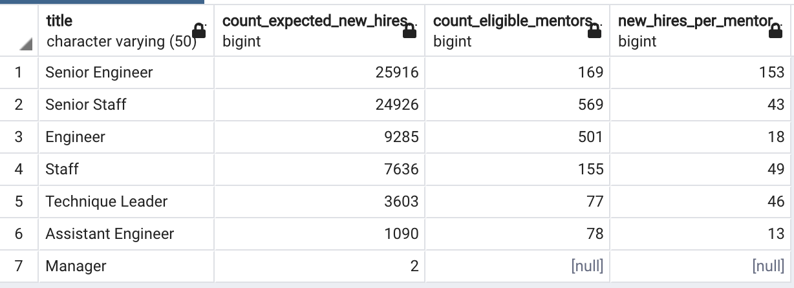

# Pewlett-Hackard-Analysis

Module 7 challenge for SQL data analysis

## Overview

### The Problem

Pewlett Hackard is anticipating a number of their employees entering retirement soon (what they are referring to as a *“silver tsunami”*). They previously have used Excel to store and manage their employee information, but have recently upgraded to an SQL database system. Due to the upcoming retirement rush, Pewlett Hackard is looking to analyze their employee data to find information to help prepare for this event.

### Questions to Answer

1. Who (what roles/department members) are approaching retirement?

2. How many employees does this include?

3. How many employees are eligible to be mentors for (i.e. train) new hires?

   

## Results

### Employees Approaching Retirement (Deliverable 1)

Pewlett Hackard considers employees who were born between January 1, 1952 and December 31, 1955 at ages close to a retirement age.

- Employee data from various files are extracted to represent the names, titles, and employment dates of all employees by running the following query:

  ```sql
  -- Create table for retirement_titles
  SELECT e.emp_no,
  	e.first_name,
  	e.last_name,
  	ttl.title,
  	ttl.from_date,
  	ttl.to_date
  INTO retirement_titles
  FROM employees as e
  INNER JOIN titles as ttl
  	ON (e.emp_no = ttl.emp_no)
  WHERE (birth_date BETWEEN '1952-01-01' AND '1955-12-31')
  ORDER BY e.emp_no;
  SELECT * FROM retirement_titles;
  ```

  The query results are saved into the `retirement_titles` table and exported as [retirement_titles.csv](https://raw.githubusercontent.com/luperrin/07-Pewlett-Hackard-Analysis-lukeperrin/main/Data/retirement_titles.csv).

- The `retirement_titles` table includes all employees from past and present. The current employees are isolated by setting their `to_date` to `'9999-01-01'`. Also, since some employees in this table changed titles during their time at Pewlett Hackard, their names (and `emp_no`'s) are listed multiple times. We are ultimately interested in seeing the total number of employees by title that are close to retirement. To clean and meet these ends, the following queries are run:

  ```sql
  -- Use Dictinct with Orderby to remove duplicate rows
  SELECT DISTINCT ON (rt.emp_no) rt.emp_no,
  	rt.first_name,
  	rt.last_name,
  	rt.title
  INTO unique_titles
  FROM retirement_titles as rt
  WHERE (rt.to_date = '9999-01-01')
  ORDER BY rt.emp_no, rt.to_date DESC;
  
  -- Query to retrieve the number of employees by their most recent job title who are about to retire
  SELECT COUNT(ut.title),
  	ut.title
  INTO retiring_titles
  FROM unique_titles as ut
  GROUP BY ut.title
  ORDER BY COUNT(ut.title) DESC;
  ```

  The unique title query results are saved into the `unique_titles` table and exported as [unique_titles.csv](https://raw.githubusercontent.com/luperrin/07-Pewlett-Hackard-Analysis-lukeperrin/main/Data/unique_titles.csv). Likewise, the current employees query results are saved into the `retiring_titles` table and exported as [retiring_titles.csv](https://raw.githubusercontent.com/luperrin/07-Pewlett-Hackard-Analysis-lukeperrin/main/Data/retiring_titles.csv).

  

  ### Employees Eligible for Mentorship (Deliverable 2)

  Pewlett Hackard considers employees who were born in the year 1965 eligible for mentoring new hires.

- Employee data from two files are extracted to represent the names, titles, and employment dates of all current employees eligible to be mentors by running the following query:

  ```sql
  -- Create Mentorship Eligibility table that holds the employees who are eligible to participate in a mentorship program
  SELECT DISTINCT ON (e.emp_no) e.emp_no,
  	e.first_name,
  	e.last_name,
  	e.birth_date,
  	de.from_date,
  	de.to_date,
  	ttl.title
  INTO mentorship_eligibilty
  FROM employees as e
  INNER JOIN dept_emp AS de
  ON (e.emp_no = de.emp_no)
  INNER JOIN titles AS ttl
  ON (e.emp_no = ttl.emp_no)
  WHERE (de.to_date = '9999-01-01')
  	AND (e.birth_date BETWEEN '1965-01-01' AND '1965-12-31')
  ORDER BY e.emp_no;
  ```

- The query results are saved into the `mentorship_eligibilty` table and exported as [mentorship_eligibilty.csv](https://raw.githubusercontent.com/luperrin/07-Pewlett-Hackard-Analysis-lukeperrin/main/Data/mentorship_eligibilty.csv).


## Summary

By looking at these files, we see that there are quite a few Pewlett Hackard employees approaching retirement. This concern raises the following two questions:


#### 1. How many roles will need to be filled as the "silver tsunami" begins to make an impact?

To answer this question, we will need to look at the `retiring_titles` table. We will start by looking at the counts for each title:
```sql
SELECT * FROM retiring_titles;
```

This query returns the following table:

| count | title              |
| :---: | :----------------- |
| 25916 | Senior Engineer    |
| 24926 | Senior Staff       |
| 9285  | Engineer           |
| 7636  | Staff              |
| 3603  | Technique Leader   |
| 1090  | Assistant Engineer |
|   2   | Manager            |

We can also count how many titles (which is 7) need to be fulfilled by running:

```sql
-- a. Number of titles needing to be filled
SELECT COUNT(title) FROM retiring_titles;
```

Lastly, we can count the total number of employees (which is 72,458) that are retiring and need their positions’ filled by running:

```sql
-- b. Total number of positions needing to be filled
SELECT SUM("count") FROM retiring_titles;
```


#### 2. Are there enough qualified, retirement-ready employees in the departments to mentor the next generation of Pewlett Hackard employees?

This question requires us to query from the `mentorship_eligibilty` table and compare those counts against the counts presented by `retiring_titles`. We will accomplish this and organize the data by `title` by running the following query:

```sql
-- 2. Are there enough qualified, retirement-ready employees in the departments to mentor the next generation of Pewlett Hackard employees?
SELECT COUNT(me.title),
	me.title
FROM mentorship_eligibilty as me
GROUP BY me.title
ORDER BY COUNT(me.title) DESC;
```

This query returns the following table:

| count | title              |
| :---: | :----------------- |
|  569  | Senior Staff       |
|  501  | Engineer           |
|  169  | Senior Engineer    |
|  155  | Staff              |
|  78   | Assistant Engineer |
|  77   | Technique Leader   |
|   0   | Manager            |

We can look at the preparedness of the company for the *silver tsunami* by considering how many new hires there are expected to be per mentor. This can be accomplished by running the following calculation and query:
```sql
-- Query calculation to determine the number of expected new hires per mentor
SELECT rt.title,
	rt.count as "count_expected_new_hires",
	em.count as "count_eligible_mentors"
INTO count_mentor_newhires
FROM retiring_titles as rt
FULL OUTER JOIN eligible_mentors as em
	ON (rt.title = em.title);
	
SELECT cmn.title, 
	cmn.count_expected_new_hires, 
	cmn.count_eligible_mentors, cmn.count_expected_new_hires/cmn.count_eligible_mentors as "new_hires_per_mentor"
FROM count_mentor_newhires as cmn;
```

This yields the following table wherein `"new_hires_per_mentor"` presents the approximate number of new hires that each mentor-eligible employee would need to train:



We can see by this table that there are some titles that will need have quite a heavy training load for mentors. It is recommended that Pewlett Hackard expand their mentor program in order to prepare for the new hire influx.
